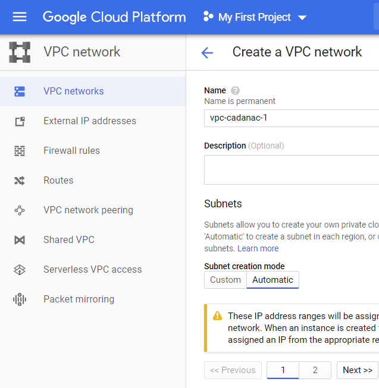
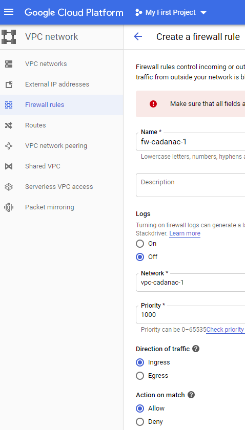
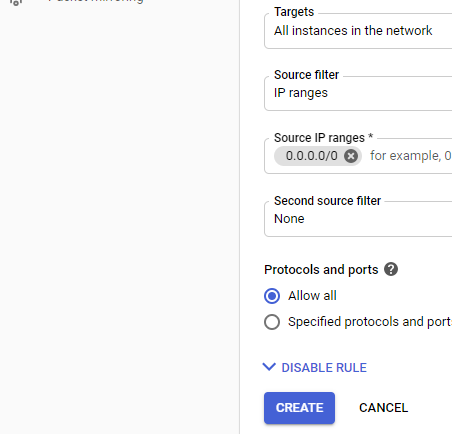
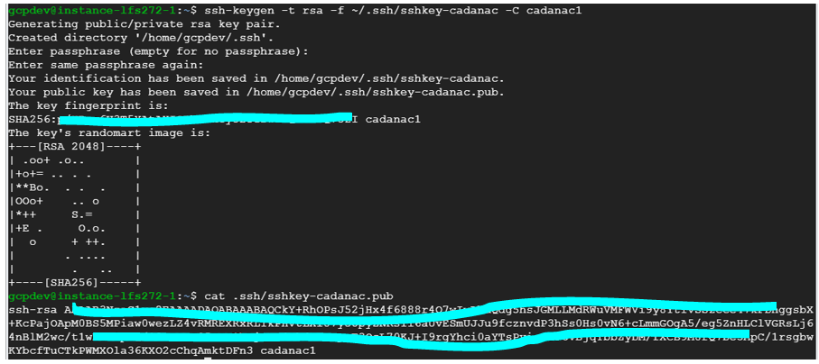
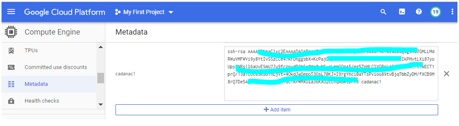
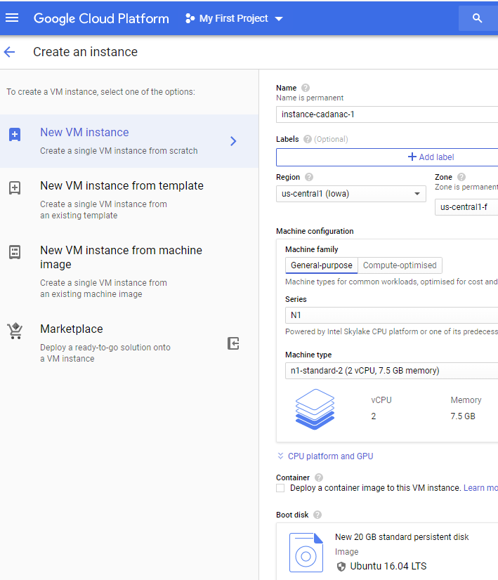
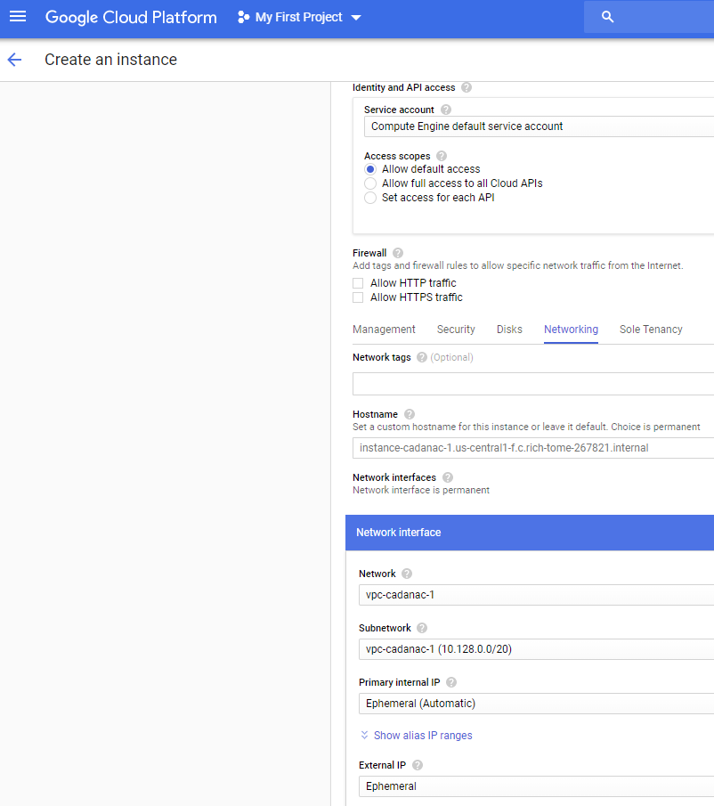
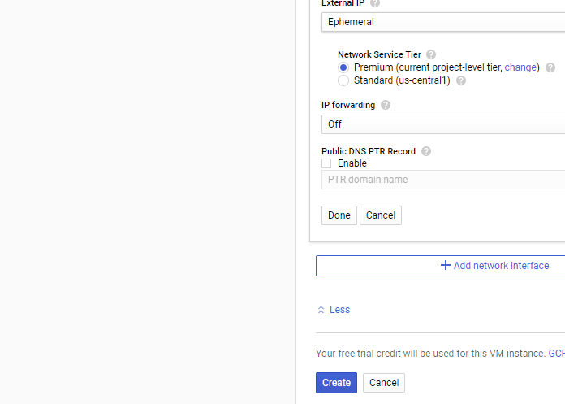
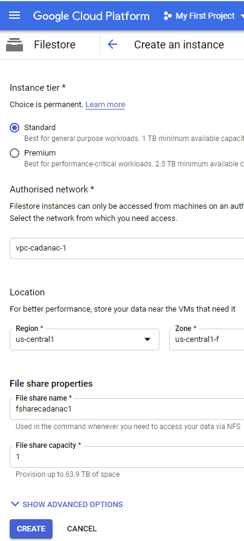
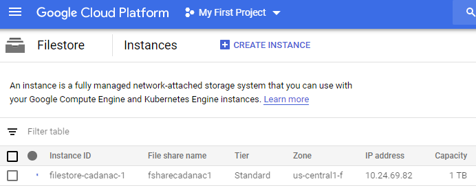

# CADANAC - A System and Method for tracking Covid19 and multiple host infections using Google Cloud, Kubernetes and Hyperledger Fabric


**Maintainers:** [hrad-h](https://github.com/hrad-h/)

Cadanac uses Google Cloud PAAS.  AWS and Azure Cloud are other options.

## Here are the steps to create the GCP PAAS Technology Archicture

Technology Architecture is the lowest layer of the Cadanac Stack.

The next layer up is Kubernetes.

Start with the lowest layer and continue up.

These commands are listed for manual entry; proper DevOps CICD Pipelines are coming to automate the entire Cadanac deployment.

### Step 1: First create a VPC to share the Cadanac local area network with many GCE instances

Kubernetes runs on these GCE instances.

```sh
gcloud compute --project=rich-tome-267821 networks create vpc-cadanac-1 --subnet-mode=auto
```
or using the GCP web control panel




### Step 2: Next create Firewall Rules so that the Cadanac VPC may be accessible from the public internet to reach Cadanac Kubernetes Services

These firewall rules are for public access to the Cadanac Hyperledger Fabric system; not for Development and Administration.  Use SSH for that (next step).

```sh
gcloud compute --project=rich-tome-267821 firewall-rules create fw-cadanac-1 --direction=INGRESS --priority=1000 --network=vpc-cadanac-1 --action=ALLOW --rules=all --source-ranges=0.0.0.0/0
```
or using the GCP web control panel






### Step 3: For Cadanac Development and Administration create SSH Keys to connect from your local device to the Cadanac VPC

Run these commands from a Unix shell, or from a similar UI tool.



copy/paste the ssh-rsa public key into GCE Metadata



### Step 4: Finally create the GCE PAAS virtual servers upon which the Cadanac system runs

```sh
gcloud beta compute --project=rich-tome-267821 instances create instance-cadanac-1 --zone=us-central1-f --machine-type=n1-standard-2 --subnet=vpc-cadanac-1 --network-tier=PREMIUM --maintenance-policy=MIGRATE --service-account=702928203601-compute@developer.gserviceaccount.com --scopes=https://www.googleapis.com/auth/devstorage.read_only,https://www.googleapis.com/auth/logging.write,https://www.googleapis.com/auth/monitoring.write,https://www.googleapis.com/auth/servicecontrol,https://www.googleapis.com/auth/service.management.readonly,https://www.googleapis.com/auth/trace.append --image=ubuntu-1604-xenial-v20200317 --image-project=ubuntu-os-cloud --boot-disk-size=20GB --boot-disk-type=pd-standard --boot-disk-device-name=instance-cadanac-1 --no-shielded-secure-boot --shielded-vtpm --shielded-integrity-monitoring --reservation-affinity=any
```

or using the GCP web control panel






### Step 5: For Scalability and Fault Tolerance add more GCE PAAS virtual servers - create more as Cadanac demand increases

Repeat Step 4 (for example 2 times).

The GCE servers created in Steps 4 and 5 can be stopped at any time to reduce costs.

Kubernetes manages the Cadanac application components' lifetimes acroos the many GCE servers.

```sh
gcloud beta compute --project=rich-tome-267821 instances create instance-cadanac-1 --zone=us-central1-f --machine-type=n1-standard-2 --subnet=vpc-cadanac-1 --network-tier=PREMIUM --maintenance-policy=MIGRATE --service-account=702928203601-compute@developer.gserviceaccount.com --scopes=https://www.googleapis.com/auth/devstorage.read_only,https://www.googleapis.com/auth/logging.write,https://www.googleapis.com/auth/monitoring.write,https://www.googleapis.com/auth/servicecontrol,https://www.googleapis.com/auth/service.management.readonly,https://www.googleapis.com/auth/trace.append --image=ubuntu-1604-xenial-v20200317 --image-project=ubuntu-os-cloud --boot-disk-size=20GB --boot-disk-type=pd-standard --boot-disk-device-name=instance-cadanac-1 --no-shielded-secure-boot --shielded-vtpm --shielded-integrity-monitoring --reservation-affinity=any

gcloud beta compute --project=rich-tome-267821 instances create instance-cadanac-3 --zone=us-central1-f --machine-type=n1-standard-2 --subnet=vpc-cadanac-1 --network-tier=PREMIUM --maintenance-policy=MIGRATE --service-account=702928203601-compute@developer.gserviceaccount.com --scopes=https://www.googleapis.com/auth/devstorage.read_only,https://www.googleapis.com/auth/logging.write,https://www.googleapis.com/auth/monitoring.write,https://www.googleapis.com/auth/servicecontrol,https://www.googleapis.com/auth/service.management.readonly,https://www.googleapis.com/auth/trace.append --image=ubuntu-1604-xenial-v20200317 --image-project=ubuntu-os-cloud --boot-disk-size=20GB --boot-disk-type=pd-standard --boot-disk-device-name=instance-cadanac-3 --no-shielded-secure-boot --shielded-vtpm --shielded-integrity-monitoring --reservation-affinity=any
```

### Step 6: Create Google Cloud Filestore (i.e. NFS) to share the Cadanac system files with all the GCE servers created above

This is a cheat!  For Security each GCE server should have it's own copy of the Cadanac system files.  NFS is purely a convenience.

Here are some helpful links.
https://devopscube.com/nfs-servers-google-cloud-filestore/
https://console.cloud.google.com/filestore




### Step 7: On each GCE Server install NFS Client software and mount the Google Cloud Filestore

Use the GCP web control panel to find the NFS Server IP address to use in the commands below.



Then repeat for each GCE servers.

```sh
sudo apt install --yes nfs-common
sudo mkdir -p /opt/share
showmount -e 10.24.69.82
sudo chmod 777 /opt/share
df –kh
```


WARNING: MUST REPEAT THE FOLLOWING AFTER EACH REBOOT - on master GCE Server "instance-cadanac-1" only during Development

```sh
sudo mount 10.24.69.82:/fsharecadanac1 /opt/share
```


## Summary

The Cadanac Technology Architecture consists of:

- 3 GCE Virtual Servers
- 1 NFS Shared File System
- 1 VPN

Kubernetes Cluster Pods are scheduled and load balanced to these Virtual Servers.

Kubernetes Persistent Volumes are mapped to NFS.

Kubernetes NodePort Services are accessible from the public internet over the VPN.
